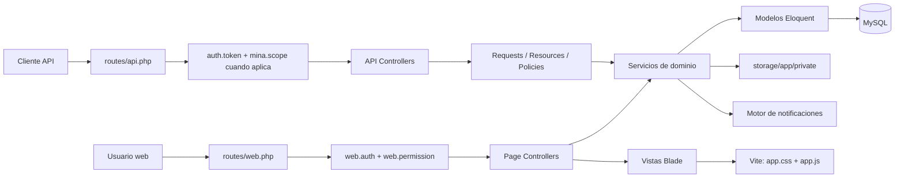
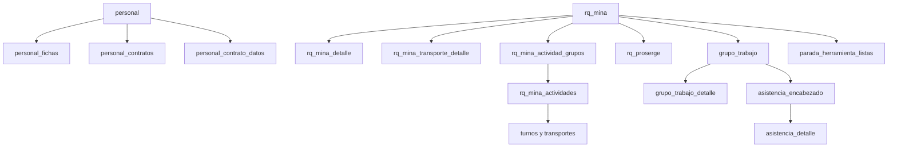

# Guia tecnica integral de traspaso

## 1. Objetivo

Este documento permite transferir el Sistema Proserge a otro ingeniero o area
sin depender del conocimiento oral del equipo anterior. Describe el estado real
del repositorio al 4 de junio de 2026: arquitectura, stack, modulos, datos,
flujos, seguridad, despliegue, pruebas y deuda tecnica.

El sistema es una aplicacion web interna orientada a operaciones mineras y
recursos humanos. Su proceso central conecta:

```text
Personal y ficha -> RQ Mina -> RQ Proserge -> Man Power -> Asistencia -> Faltas
                         \-> Plan operativo y herramientas por parada
```

## 2. Resumen ejecutivo

- El backend es Laravel 12 sobre PHP 8.2+ y MySQL.
- La interfaz es Blade renderizado por servidor, con JavaScript y CSS propios.
- No existe un framework SPA. Vite compila dos entradas globales.
- El codigo de negocio se organiza por modulos en `app/Modules`.
- Los modelos Eloquent estan centralizados en `app/Models`.
- Existen dos superficies: web autenticada por sesion personalizada y API v1
  autenticada por tokens Bearer propios.
- Los permisos se definen por pantalla/modulo y accion.
- El alcance por mina se modela por usuario, pero no todas las rutas lo aplican.
- Los documentos sensibles se guardan en el disco privado `local`.
- La base ha evolucionado mediante scripts SQL iniciales y migraciones Laravel.
- Produccion usa cPanel y actualmente no dispone de npm, por lo que
  `public/build` debe llegar compilado o compilarse en otro entorno.

## 3. Diagrama de arquitectura



## 4. Stack completo

| Capa | Tecnologia | Uso real |
|---|---|---|
| Lenguaje | PHP `^8.2` | Backend, vistas y comandos |
| Framework | Laravel `^12.0` | Routing, Eloquent, validacion, servicios |
| Base de datos | MySQL | Datos operativos, usuarios, permisos, notificaciones |
| Vistas | Blade | Interfaz web renderizada en servidor |
| Frontend | JavaScript nativo | Modales, filtros, buscadores, sidebar, paginacion |
| Estilos | CSS propio + Tailwind CSS 4 | Layout global y estilos por modulo |
| Build | Vite 7 | Genera `public/build/manifest.json` y assets |
| HTTP | Axios | Disponible para llamadas cliente |
| Excel | PhpSpreadsheet 5 | Importacion, exportacion y contratos |
| PDF | Dompdf, FPDF, FPDI | Fichas y documentos PDF |
| Pruebas | PHPUnit 11 | Principalmente pruebas Feature con MySQL |
| Calidad | Laravel Pint | Formato PHP |
| Logs | Laravel Log / Pail | Diagnostico y trazas de notificaciones |
| Correo ficha | Outlook local o `mailto:` | No usa SMTP para ese flujo |

Las versiones exactas y scripts se encuentran en `composer.json`,
`package.json`, `vite.config.js` y `phpunit.xml`.

## 5. Estructura del repositorio

```text
app/
  Console/Commands/       Tareas programadas y comandos Artisan
  Http/Middleware/        Autenticacion, permisos y alcance por mina
  Models/                 Modelos Eloquent de todas las areas
  Modules/                Codigo organizado por dominio
  Providers/              Bootstrap transversal de la aplicacion
  Shared/                 Servicios y soporte compartido
  Support/Rbac/           Catalogo y evaluacion de permisos
bootstrap/app.php         Registro de rutas, middleware y excepciones
config/                   Configuracion Laravel
database/migrations/      Evolucion incremental de la base
database/setup/           Esquema SQL inicial y extensiones historicas
public/                   Punto de entrada, build, favicon y recursos publicos
resources/
  contract-templates/     Plantillas Excel de contratos
  css/                    CSS global y por modulo
  js/                     JavaScript global
  views/                  Vistas Blade
routes/                   Rutas web, API y programador
storage/app/private/      Archivos privados y trabajos temporales
storage/logs/             Logs de aplicacion
tests/Feature/            Pruebas de flujos y API
```

## 6. Patron interno de los modulos

Un modulo completo normalmente contiene:

```text
Controllers/   Reciben HTTP; PageController sirve Blade y Controller sirve API
Requests/      Reglas de validacion para API o flujos complejos
Resources/     Forma estandar de respuestas API
Services/      Reglas de negocio, transacciones y consultas
Policies/      Autorizacion adicional de dominio
Support/       Catalogos, normalizadores o configuraciones del modulo
```

Regla para nuevas funcionalidades: mantener el controlador delgado, validar en
Request o controlador de pagina, y concentrar transacciones y cambios de estado
en Services. No duplicar reglas entre web y API.

## 7. Puntos de entrada y autenticacion

### Web

- Rutas: `routes/web.php`.
- Login: `App\Modules\Auth\Controllers\LoginPageController`.
- Proteccion: middleware `web.auth`.
- Autorizacion: middleware `web.permission:modulo,accion`.
- La sesion guarda `auth_token`, `user_id` y permisos efectivos.
- `WebAuthenticate` vuelve a leer roles y permisos en cada solicitud para que
  los cambios administrativos tengan efecto sin cerrar sesion.

La sesion web no utiliza el guard Laravel tradicional. `config/auth.php` aun
apunta al modelo `User`, pero el login real consulta `App\Models\Usuario`.

### API

- Rutas: `routes/api.php`, prefijo `/api/v1`.
- Login: `POST /api/v1/auth/login`.
- Los tokens se guardan hasheados en `auth_tokens`, duran 12 horas y se validan
  con `AuthenticateToken`.
- Las respuestas API usan `App\Shared\Support\ApiResponse`.
- `EnsureMinaScope` valida `usuario_mina_scope` solo cuando una ruta lo incluye.

### Permisos

- Catalogo de pantallas y acciones: `app/Support/Rbac/PermissionCatalog.php`.
- Normalizacion y union de roles: `PermissionMatrix.php`.
- Un usuario tiene rol principal y puede tener roles adicionales.
- Los permisos efectivos son la union de todos sus roles.
- `ADMIN`, `GERENTE` y `SUPERADMIN` reciben acceso total.
- Una accion operativa habilitada fuerza tambien `ver` y `dashboards`.
- Blade usa la directiva `@allowed('modulo', 'accion')`.

### Alcance por mina

- Tabla: `usuario_mina_scope`.
- Middleware: `EnsureMinaScope`.
- Roles globales evitan la restriccion.
- Los servicios principales tambien filtran por mina segun el usuario.

## 8. Modulos funcionales

### Personal

Es el modulo mas amplio y sensible. Administra trabajadores, fichas, documentos,
contratos, ceses, reactivaciones, importaciones y exportaciones.

Archivos centrales:

- `PersonalPageController`: listado, alta, edicion, cese y activacion web.
- `PersonalFichaController`: importacion, links temporales, revision y export.
- `PublicPersonalFichaController`: formulario publico por token.
- `PersonalDocumentoController`: documentos y contrato firmado.
- `PersonalContratoController`: historial de contratos y snapshots.
- `PersonalContratoDatoController`: campos contractuales y PDF firmado.
- `PersonalContratoFormatoController`: seleccion, vista previa y Excel.
- `PersonalService`: consulta, buscador, estados y cese.
- `PersonalFichaService`: flujo completo de ficha.
- `PersonalContratoService`: historial y snapshots inmutables por contrato.
- `PersonalContratoDatoService`: datos contractuales vigentes.

Estados relevantes de ficha:

```text
PENDIENTE_COMPLETAR_FICHA -> FICHA_ENVIADA -> APROBADO
                                  \-> OBSERVADO -> FICHA_ENVIADA
                                  \-> RECHAZADO
```

Flujo actual:

1. RRHH crea/importa un trabajador y genera o activa un link.
2. El colaborador completa la ficha publica, familiares, firma, huella y archivos.
3. Al enviar, la ficha queda para revision; el trabajador no debe quedar activo.
4. Si se observa, se conserva el link y se puede reenviar el correo con motivo.
5. Si se aprueba, la situacion pasa a activa y el estado contractual a
   `FALTA_CONTRATO`.
6. RRHH completa `personal_contrato_datos` y descarga un formato Excel.
7. Al subir el contrato firmado PDF, el estado se normaliza a `ACTIVO`.
8. Al cesar, se exige motivo y se cierra un contrato con snapshot.
9. Al reactivar, se crea el siguiente numero de contrato copiando datos editables.

Los documentos se guardan en `storage/app/private`, no en el disco publico.

### RQ Mina

Representa una parada solicitada por la mina.

- Cabecera: destino, rango de fechas, semana, observaciones y supervisor de
  herramientas.
- Destinos: minas, talleres y oficinas provenientes de catalogos.
- Detalle: puestos/cantidades y transporte general.
- Plan operativo: grupos, SAIT/puntos de trabajo, sector, area, AIT, trabajos,
  turnos, supervisores, unidades de carga y transporte.
- Opciones reutilizables: `rq_mina_field_options`, compartidas por todos.
- Al enviar cambia de borrador a enviado y puede emitir notificaciones.

Servicio principal: `App\Modules\RQMina\Services\RQMinaService`.

### RQ Proserge

Es la respuesta interna a un RQ Mina. Permite asignar o retirar personal
disponible y representar cumplimiento parcial o completo.

Servicio principal: `RQProsergeService`.

### Man Power

Transforma las paradas/RQ aprobados en grupos de trabajo con fecha, turno,
supervisor, destino, transporte y personal asignado.

- `ManPowerParadasService`: lectura de paradas y personal aprobado.
- `GrupoTrabajoService`: creacion, edicion y miembros del grupo.

### Asistencia

Opera sobre grupos de trabajo. Permite marcar asistencia individual o masiva,
cerrar y reabrir jornadas. Un `grupo_trabajo` puede tener un
`asistencia_encabezado` y muchos detalles.

Servicios: `AsistenciaService` y `AsistenciaCierreService`.

### Faltas

Consulta y corrige faltas vinculadas a asistencia. Permite actualizar, corregir
la asistencia origen y anular registros.

Servicios: `FaltasService` y `CorregirFaltaService`.

### Herramientas por parada

Administra listas semanales de herramientas por grupos de una parada:

- herramientas solicitadas y adicionales;
- cantidad, observaciones y datos de pedido;
- fecha limite y envio;
- correo/recordatorio al supervisor;
- alertas de vencimiento.

Servicio principal: `ParadaHerramientaService`.

### Notificaciones

Motor interno desacoplado:

1. Un modulo llama `NotificationService::emit(codigo, contexto)`.
2. Se busca un tipo activo en `notification_types`.
3. `NotificationRecipientResolverService` evalua usuarios activos, permisos,
   alcance por mina, preferencias por rol y preferencias individuales.
4. Se crea `notification_event` y un `notification_recipient` por usuario.
5. La cabecera y bandeja consultan `NotificationInboxService`.

La campana depende de `notification_user_settings` o, si no existe una
preferencia explicita, del permiso `notificaciones.ver`.

### Seguridad

Administra usuarios, roles, acciones por pantalla, roles adicionales, alcance
por mina, contrasenas, estado y preferencias de notificaciones.

Servicio principal: `RoleManagementService`.

### Catalogos

Administra minas, talleres, oficinas y paraderos. Son datos maestros usados por
RQ Mina, Personal, Man Power y Asistencia.

### Otros

- Dashboard: indicadores agregados de los modulos.
- Bienestar: bloqueos y restricciones de personal.
- Evaluaciones: desempeno, supervisor, residente y promedios.
- Mi Asistencia: consulta personal.
- Perfil: datos del usuario autenticado.
- System: salud y comprobacion de scope.

## 9. Modelo de datos por dominio

La mayoria de tablas de negocio usan UUID de texto y timestamps.

| Dominio | Tablas principales |
|---|---|
| Seguridad | `roles`, `usuarios`, `usuario_roles`, `usuario_mina_scope`, `auth_tokens` |
| Personal | `personal`, `personal_mina`, `personal_bloqueo` |
| Fichas | `personal_fichas`, `personal_ficha_links`, `personal_ficha_familiares`, `personal_ficha_archivos` |
| Contratos | `personal_contratos`, `personal_contrato_datos` |
| Catalogos | `minas`, `talleres`, `oficinas`, `mina_paraderos` |
| RQ Mina | `rq_mina`, `rq_mina_detalle`, `rq_mina_transporte_detalle`, `rq_mina_field_options` |
| Plan operativo | `rq_mina_actividad_grupos`, `rq_mina_actividades`, `rq_mina_actividad_turnos`, `rq_mina_actividad_transportes` |
| RQ Proserge | `rq_proserge`, `rq_proserge_detalle` |
| Man Power | `grupo_trabajo`, `grupo_trabajo_detalle` |
| Asistencia | `asistencia_encabezado`, `asistencia_detalle` |
| Faltas | `faltas` |
| Evaluaciones | `evaluacion_desempeno`, `evaluacion_supervisor`, `evaluacion_residente`, `promedio_desempeno` |
| Herramientas | `parada_herramienta_listas`, `parada_herramienta_grupos`, `parada_herramienta_items` |
| Notificaciones | `notification_types`, `notification_events`, `notification_recipients`, `notification_preferences`, `notification_role_preferences`, `notification_user_settings` |

Relaciones de negocio importantes:



`database/setup` representa el esquema inicial historico. Las migraciones son la
fuente para evolucionar ambientes ya instalados. Toda nueva modificacion debe
crearse como migracion idempotente y probarse sobre una copia realista.

## 10. Archivos, Excel, PDF y correo

### Archivos privados

`config/filesystems.php` define el disco `local` en `storage/app/private` y
habilita `serve => true`. Laravel registra rutas `storage/{path}` asociadas a
ese disco. Deben auditarse porque contienen documentos personales.

### Excel

- Import/export de personal: `ImportPersonalService`, `ExportPersonalService`.
- Importacion de ficha macro: `PersonalFichaMacroExtractor`.
- Export de fichas: `PersonalFichaExportService`.
- Contratos: `PersonalContratoFormatoService`.
- Plantillas: `resources/contract-templates/*.xlsx`.

### PDF

- Ficha: `PersonalFichaPdfService`.
- Documentos de gestacion y otros controladores pueden generar o servir PDF.
- El contrato firmado se guarda como PDF privado.

### Correo

`OutlookMailService` intenta usar `storage/scripts/send-outlook-email.ps1` en
Windows. Fuera de Windows devuelve una URL `mailto:` para abrir el cliente del
usuario. Esto significa que el flujo de ficha no es un envio SMTP autonomo en
servidor. Para correos confiables desde cPanel debe implementarse un Mailable
Laravel con SMTP/cola y registrar estado de entrega.

## 11. Frontend

- Layout principal: `resources/views/layouts/app.blade.php`.
- Cabecera y notificaciones: `resources/views/partials/header.blade.php`.
- Navegacion: `resources/views/partials/sidebar.blade.php`.
- CSS global: `resources/css/app.css`.
- CSS por dominio: `resources/css/modules`.
- JavaScript global: `resources/js/app.js`.

`app.js` administra sidebar persistente/redimensionable, menus, notificaciones,
modales, paneles plegables y paginacion cliente. Las preferencias visuales se
guardan en `localStorage`.

Muchas vistas contienen JavaScript y CSS inline. Funciona, pero complica las
pruebas, reutilizacion y mantenimiento. Al ampliar un flujo, extraer primero los
comportamientos compartidos a `resources/js` y los estilos a `resources/css`.

## 12. Notificaciones y tareas programadas

Comandos:

- `php artisan notifications:cleanup-expired`
- `php artisan herramientas-parada:alertas-vencimiento`

Programacion en `routes/console.php`:

- limpieza de notificaciones: todos los dias a las 02:10;
- alertas de herramientas: todos los dias a las 07:30.

Produccion necesita un cron cada minuto:

```cron
* * * * * cd /ruta/al/proyecto && php artisan schedule:run >> /dev/null 2>&1
```

Los tipos emitidos actualmente incluyen RQ Mina enviado, RQ Proserge parcial o
completado, ficha completada, errores/importacion de personal, usuario creado o
desactivado, rol/permisos modificados y herramientas por vencer.

## 13. Pruebas

Las pruebas Feature cubren API y servicios clave:

- asistencia, dashboard, evaluaciones, faltas y Man Power;
- herramientas por parada;
- RQ Mina y RQ Proserge;
- contratos, formatos, aprobacion y reenvio de ficha;
- notificaciones de usuario y middleware de permisos.

Ejecutar:

```bash
php artisan config:clear
php artisan test
```

`phpunit.xml` usa MySQL `proserge_app_test`, usuario `root` sin contrasena. Crear
esa base antes de correr pruebas. Nunca apuntar el runner a produccion.

Faltan pruebas de navegador para los flujos con mas JavaScript, pruebas de
despliegue y una cobertura consistente para controladores web.

## 14. Observabilidad y diagnostico

- Logs: `storage/logs/laravel.log`.
- Salud Laravel: `GET /up`.
- Salud API: `GET /api/v1/health`.
- Notificaciones escriben logs detallados con prefijo `notificaciones.*`.
- Denegaciones web escriben `web.permission_denied`.
- `php artisan route:list` permite verificar rutas y cache.
- `php artisan about` ayuda a confirmar entorno, drivers y caches.

Para incidentes de permisos revisar primero: usuario activo, roles principal y
adicionales, matriz efectiva, middleware de la ruta y alcance de mina.

## 15. Riesgos y deuda tecnica priorizada

### Prioridad alta

1. Las rutas API de escritura de minas estan fuera de `auth.token`. Proteger
   `POST`, `PUT` e inactivacion antes de exponer la API.
2. Auditar las rutas automaticas `storage/{path}` del disco privado. Verificar
   que no permitan descargar o subir archivos personales sin autorizacion.
3. cPanel no tiene npm. Si falta `public/build/manifest.json`, toda vista con
   `@vite` falla con error 500.
4. El envio de ficha usa Outlook local o `mailto:`. No garantiza entrega
   automatica desde produccion.
5. `.env.example` usa SQLite y valores genericos; puede crear instalaciones
   inconsistentes.
6. El entorno local reporta `Timezone: UTC`. Validar y acordar la zona horaria
   de negocio antes de confiar en semanas, vencimientos y cierres diarios.

### Prioridad media

1. Conviven scripts SQL de setup y migraciones; definir una unica estrategia
   reproducible para nuevas instalaciones.
2. La migracion `2026_06_01_000200_add_grupo_trabajo_id_to_asistencia_encabezado`
   ha presentado conflicto de indice duplicado en una instalacion local.
3. API y web no aplican el mismo nivel de permisos en todas las operaciones.
4. `AppServiceProvider` consulta/crea roles base durante solicitudes web.
5. Hay logica y estilos inline extensos en vistas Blade.
6. El polling de notificaciones genera solicitudes periodicas; evaluar colas,
   SSE o WebSockets si crece el numero de usuarios.

### Prioridad baja

1. `README`, metadata de Composer y configuraciones conservaban textos Laravel.
2. Hay cadenas con problemas de codificacion visibles como mojibake.
3. Existen modulos/tablas iniciales con implementacion parcial, por ejemplo
   asistencia remota y EPP.

## 16. Ruta recomendada de mejora

### Fase 1: estabilizar operacion

- Corregir `.env.example` sin secretos.
- Proteger rutas API y almacenamiento privado.
- Crear pipeline que compile Vite y ejecute pruebas.
- Documentar y comprobar cron, backups y restauracion.
- Añadir smoke test de login, personal, RQ Mina y documentos.

### Fase 2: consolidar arquitectura

- Unificar autorizacion web/API mediante policies o una capa comun.
- Extraer JavaScript/CSS inline.
- Mover correo a Mailables y colas.
- Crear maquinas de estado explicitas para ficha, personal, contrato y RQ.
- Separar snapshots historicos de datos editables con reglas claras.

### Fase 3: escalar

- Añadir auditoria de cambios por usuario.
- Añadir pruebas E2E y pruebas de importacion con archivos reales anonimizados.
- Mejorar observabilidad, metricas y alertas.
- Revisar indices y consultas de listados grandes.

## 17. Regla para modificar un flujo

Antes de cambiar una pantalla:

1. Localizar la ruta web y su `web.permission`.
2. Localizar PageController, Service y modelos relacionados.
3. Revisar si existe ruta API equivalente.
4. Revisar estados y efectos secundarios: notificaciones, archivos, contratos.
5. Crear migracion si cambia persistencia.
6. Añadir o actualizar prueba Feature.
7. Ejecutar pruebas, compilar Vite y verificar la vista.
8. Confirmar que `public/build/manifest.json` exista antes de desplegar.

## 18. Lista de traspaso al nuevo equipo

- Acceso al repositorio y rama principal.
- Copia segura de `.env` de produccion, sin publicarla.
- Credenciales de cPanel, MySQL, correo y dominio.
- Backup reciente de base y `storage/app/private`.
- Confirmacion de cron y version real de PHP.
- Procedimiento para compilar/publicar `public/build`.
- Usuarios responsables de RRHH, operaciones, planeamiento y logistica.
- Catalogo de estados y permisos acordado con negocio.
- Archivos Excel de ejemplo anonimizados.
- Revision de los riesgos de prioridad alta de esta guia.
